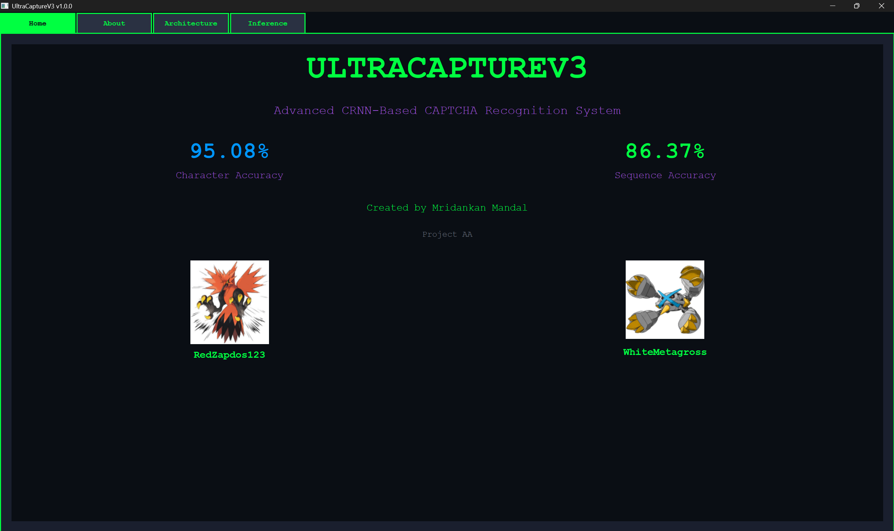
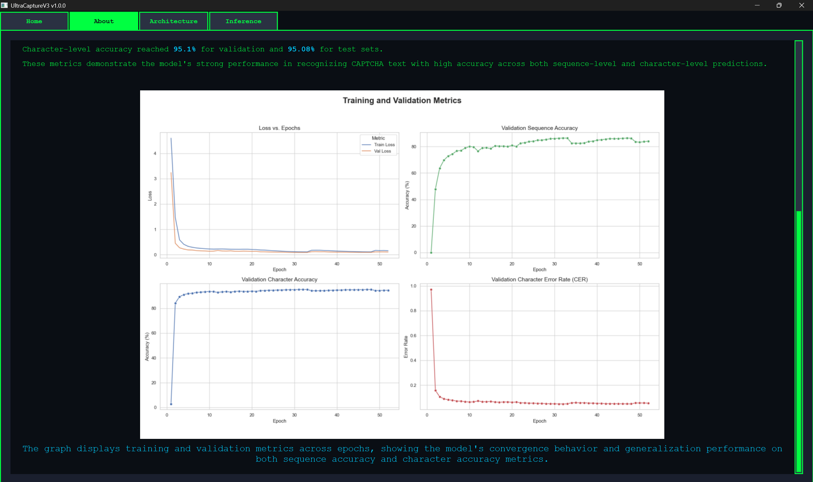
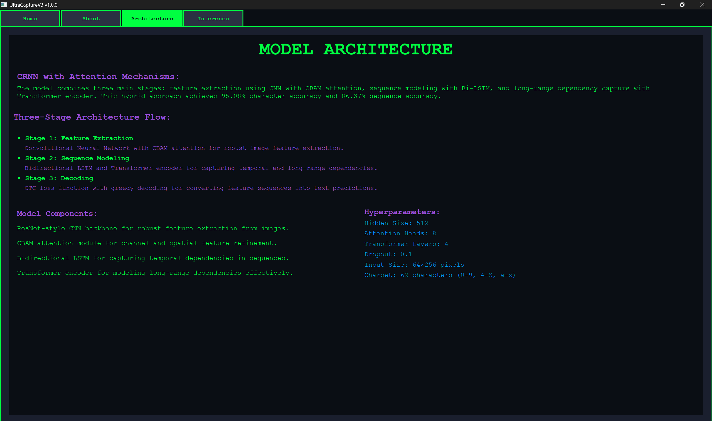

# UltraCaptureV3: Advanced CAPTCHA Recognition Desktop Application.

A professional-grade CAPTCHA recognition system featuring a hybrid CRNN (Convolutional Recurrent Neural Network) architecture with attention mechanisms. This desktop application provides a native, standalone interface for CAPTCHA text recognition with CPU-based ONNX inference for fast, cross-platform deployment without GPU requirements.

© 2025 UltraCaptureV3 | Created by Mridankan Mandal | Project AA.

---

## Key Features.

- **High Accuracy**: Achieves **95.08% Character Accuracy** and **86.37% Sequence Accuracy** on test sets.
- **Advanced Architecture**: Hybrid CRNN combining ResNet-style CNN backbone, CBAM attention, Bi-LSTM, and Transformer Encoder.
- **CPU-Based Inference**: Uses ONNX Runtime for fast, optimized CPU inference (30-100ms per image) without GPU requirements.
- **Native Desktop Application**: Professional PySide6 interface with Fallout-themed design.
- **Fallout-Themed UI**: Unique retro aesthetic with green (#00FF41), purple (#9D4EDD), and blue (#0096FF) color palette.
- **Easy Setup**: Automated setup with PowerShell scripts for environment configuration.
- **Cross-Platform**: Works on Windows, macOS, and Linux with Python 3.11+.
- **Standalone Executable**: Can be packaged as a standalone .exe file for distribution without Python installation.

---

## Project Structure.

```
UltraCaptureV3/
├── main.py                    # Application entry point
├── config.py                  # Configuration management
├── requirements.txt           # Python dependencies
├── setup.ps1                  # Setup automation script
├── start.ps1                  # Launch script
│
├── core/                      # Core inference logic
│   ├── model_manager.py       # ONNX model management
│   ├── image_processor.py     # Image preprocessing
│   ├── ctc_decoder.py         # CTC decoding
│   └── config_loader.py       # Configuration loader
│
├── ui/                        # User interface
│   ├── main_window.py         # Main application window
│   ├── tabs/                  # Tab implementations
│   │   ├── home_tab.py        # Home tab with metrics
│   │   ├── about_tab.py       # About tab with features
│   │   ├── architecture_tab.py # Architecture details
│   │   └── inference_tab.py   # Live inference interface
│   ├── widgets/               # Custom reusable widgets
│   │   ├── metric_card.py
│   │   ├── profile_card.py
│   │   ├── image_upload_widget.py
│   │   ├── prediction_display.py
│   │   └── theme_toggle.py
│   └── styles/                # QSS stylesheets
│       └── fallout_theme.qss  # Fallout-themed styling
│
├── utils/                     # Utility functions
│   ├── logger.py              # Logging configuration
│   ├── file_utils.py          # File operations
│   └── image_utils.py         # Image utilities
│
├── resources/                 # Application resources
│   ├── models/
│   │   └── best_model.onnx    # ONNX model (273MB)
│   ├── config/
│   │   └── model_config.json  # Model configuration
│   └── images/                # Profile images
│
├── venv/                      # Python virtual environment
├── Usage.md                   # Usage guide
├── InstallationAndSetup.md    # Installation instructions
├── CodeBaseIndex.md           # Complete file index
├── API.md                     # API documentation (reference)
└── LICENSE                    # MIT License
```

---

## Quick Start.

### For End Users (Standalone Executable)

If you want to use the standalone executable without Python installation:

1. Build the executable using the build scripts (see [Distribution.md: Building from Source](Distribution.md#building-from-source)).
2. Extract the generated `UltraCaptureV3-Distribution.zip` file to your desired location.
3. Double-click `UltraCaptureV3.exe` to launch the application.

**See [Distribution.md](Distribution.md) for detailed instructions and troubleshooting.**

### For Developers (Development Setup)

**First Time Setup:**
```powershell
.\setup.ps1
```

**Launch Application:**
```powershell
.\start.ps1
```

The application will launch with the Fallout-themed interface ready for CAPTCHA recognition.

**Features:**
- Drag-and-drop image upload or file browser selection.
- Real-time CAPTCHA prediction with inference timing.
- Four informative tabs: Home, About, Architecture, and Inference.
- Professional Fallout-themed interface with retro aesthetic.

**For detailed setup instructions, see [InstallationAndSetup.md](InstallationAndSetup.md).**

---

## Screenshots.

### Home Tab


The main interface displays the project title, tagline, and key performance metrics in a professional Fallout-themed design with the signature green and purple color scheme.

### About Tab: Project Overview


The About tab presents comprehensive project information including the CRNN architecture description and key features in an organized card-based layout.

### About Tab: Performance Metrics


Performance metrics section displays validation and test set accuracies with visual graphs showing the model's training progress and performance over time.

### Model Architecture


The architecture tab provides a detailed visual diagram of the hybrid CRNN model showing all components including the CNN backbone, attention mechanisms, LSTM, and transformer encoder.

### Live Inference Demonstration


The inference tab features an interactive drag-and-drop interface for uploading CAPTCHA images and displaying real-time predictions with inference timing information.

---

## Model Architecture.

The model is a custom-built Convolutional Recurrent Neural Network (CRNN) that integrates multiple advanced concepts for maximum accuracy:

- **Stage 1: Feature Extraction**: Deep CNN with ResNet-style residual blocks enhanced with CBAM (Convolutional Block Attention Module) for channel and spatial attention.
- **Stage 2: Sequence Modeling**: Bidirectional LSTM processes feature sequences, refined by Transformer Encoder for long-range dependencies.
- **Loss Function**: Connectionist Temporal Classification (CTC) for unsegmented sequence learning.

**Key Specifications:**
- Input Size: 64×256 pixels (RGB).
- Hidden Size: 512.
- Attention Heads: 8.
- Transformer Layers: 4.
- Charset: 62 characters (0-9, A-Z, a-z).
- Model Size: ~273MB (ONNX format).


The architecture section displays the CRNN model components in a retro-styled card layout, showing the convolutional backbone, CBAM attention mechanism, Bi-LSTM, and Transformer Encoder with their respective descriptions.

-----

## Dataset and Performance:

### Dataset:

The model was trained on the **Huge CAPTCHA Dataset** that's been made by the author, **Mridankan Mandal**, which has been made available on Kaggle. This dataset contains a large number of CAPTCHA images with alphanumeric characters, where the label for each image is its filename.

  * **Link**: [Huge CAPTCHA Dataset on Kaggle](https://www.kaggle.com/datasets/redzapdos123/huge-captcha-dataset)

### Performance Metrics:

The model achieves high accuracy on both the validation and unseen test sets.

| Metric             | Validation Set | Test Set |
| ------------------ | :------------: | :------: |
| Sequence Accuracy  |     86.4%      | 86.37%   |
| Character Accuracy |     95.1%      | 95.08%   |


The performance metrics table displays the model's accuracy on validation and test sets, showing both sequence accuracy and character accuracy metrics.

---

## Installation & Setup.

### Prerequisites.

- **Python** 3.11 (recommended) or 3.8+.
- **Windows, macOS, or Linux** operating system.
- **At least 500MB** free disk space.
- **Git** (optional, for cloning the repository).

### Installation (Automated).

The easiest way to set up the application is using the provided PowerShell script:

```powershell
.\setup.ps1
```

This script will automatically:
- Check for Python installation.
- Create a Python virtual environment.
- Install all dependencies (PySide6, ONNX Runtime, Pillow, NumPy).
- Verify the ONNX model exists.
- Verify all resources are in place.

### Running the Application.

Launch the desktop application with:

```powershell
.\start.ps1
```

The application will open with the Fallout-themed interface ready for use.

For detailed setup and usage instructions, see:
- **[Distribution Guide](Distribution.md)**: Standalone executable and distribution information.
- **[Installation and Setup Guide](InstallationAndSetup.md)**: Complete setup instructions for development.
- **[Usage Guide](Usage.md)**: How to use the desktop application.
- **[Codebase Index](CodeBaseIndex.md)**: Project structure and file descriptions.

---

## Technology Stack.

### Desktop Application (PySide6)
- **Framework**: PySide6 6.6.1 (Qt for Python)
- **Inference Engine**: ONNX Runtime 1.17.1 (CPU-based)
- **Image Processing**: Pillow 10.1.0
- **Numerical Operations**: NumPy 1.24.3
- **Design**: Fallout-Themed UI with QSS Stylesheets
- **Python Version**: 3.8+

### Model & Inference
- **Model Format**: ONNX (Open Neural Network Exchange)
- **Model Size**: ~273MB
- **Inference Speed**: 30-100ms per image (CPU)
- **Architecture**: Hybrid CRNN with attention mechanisms
- **Supported Characters**: 62 (0-9, A-Z, a-z)

---

## Model Performance.

| Metric             | Validation Set | Test Set |
| ------------------ | :------------: | :------: |
| Sequence Accuracy  |     86.4%      | 86.37%   |
| Character Accuracy |     95.1%      | 95.08%   |

**Inference Time**: 30-100ms per image (CPU).
**Model Size**: 273MB (ONNX format).

---

## Resources.

- **GitHub Repository**: [CRNN_Captcha_Recognition](https://github.com/WhiteMetagross/CRNN_Captcha_Recognition).
- **Dataset**: [Huge CAPTCHA Dataset on Kaggle](https://www.kaggle.com/datasets/redzapdos123/huge-captcha-dataset).
- **Creator**: Mridankan Mandal (RedZapdos123, WhiteMetagross).

---

## Documentation.

- **[Installation and Setup Guide](InstallationAndSetup.md)**: Detailed setup instructions for the desktop application.
- **[Usage Guide](Usage.md)**: How to use the desktop application features.
- **[Codebase Index](CodeBaseIndex.md)**: Complete file structure and descriptions.
- **[API Documentation](API.md)**: Reference documentation (for historical context).

---

## License and Attribution.

This project is created by **Mridankan Mandal** as part of **Project AA**.

The model was trained on the **Huge CAPTCHA Dataset** available on Kaggle.

© 2025 UltraCaptureV3. All rights reserved.

Licensed under the MIT License: see the [LICENSE](./LICENSE) file for details.

---

## Support and Troubleshooting.

For setup issues, see the [Installation and Setup Guide](InstallationAndSetup.md).

For usage questions, see the [Usage Guide](Usage.md).

For technical details, see the [Codebase Index](CodeBaseIndex.md).

For issues or questions, please refer to the documentation files or check the GitHub repository.
