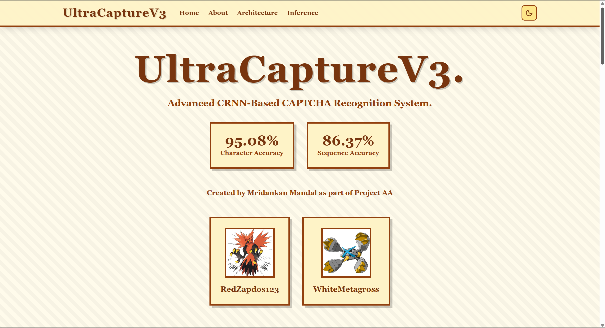
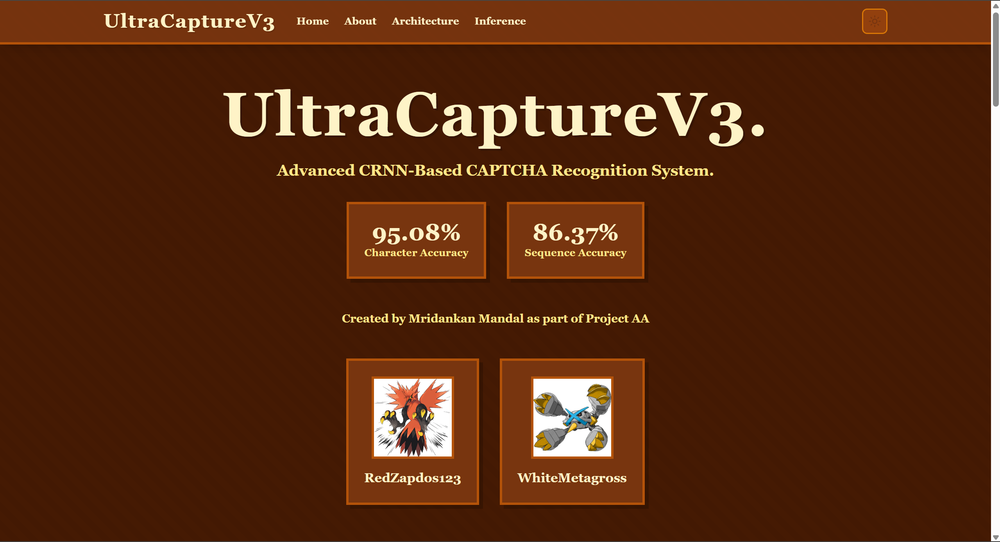
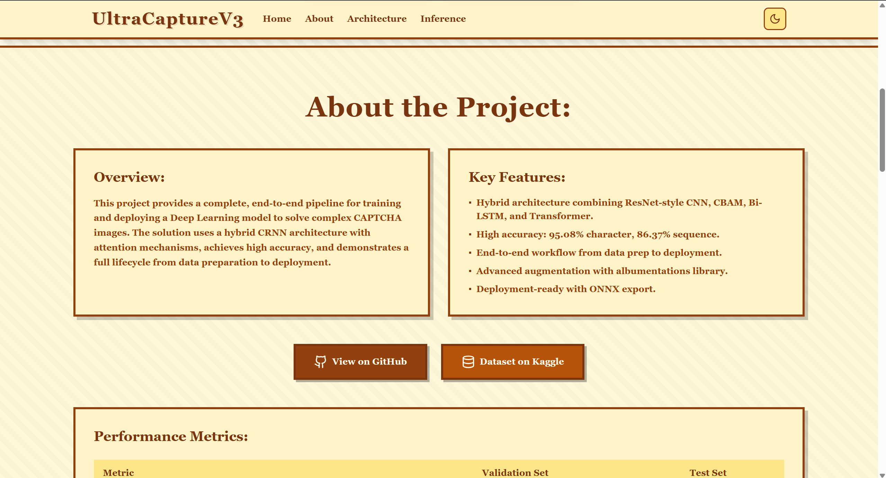
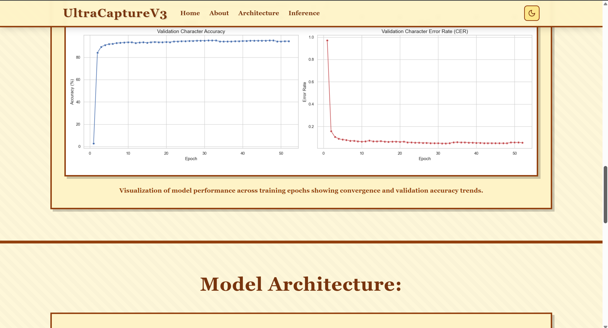
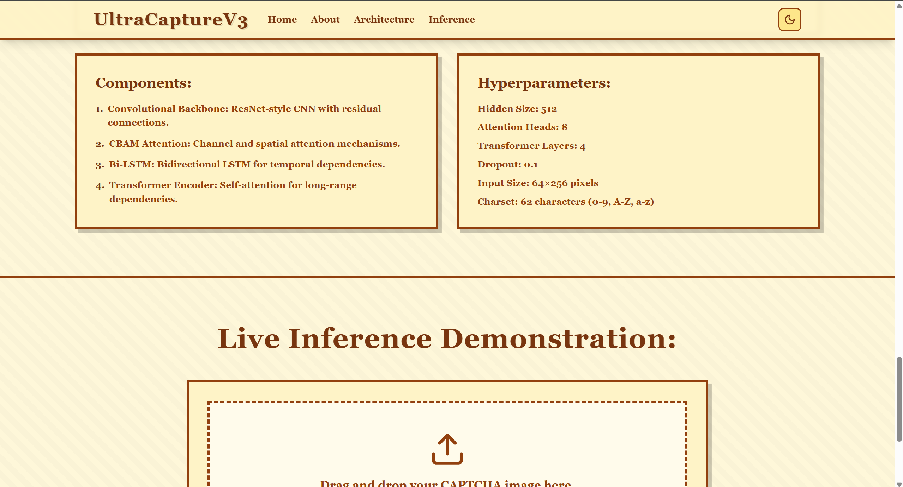
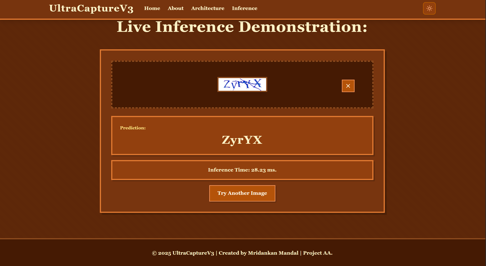

# Usage Guide:

This guide explains how to use the UltraCaptureV3 web application to recognize CAPTCHA images.

## Starting the Application:

Before using the application, ensure both the backend and frontend servers are running. See the [Installation and Setup Guide](InstallationAndSetup.md) for detailed instructions.

### Using the Automated Start Script (Recommended):

The easiest way to start the application is using the provided PowerShell script:

```powershell
.\start.ps1
```

**What the script does:**
- Activates the Python virtual environment in the backend directory.
- Starts the Flask backend server on http://localhost:5000 with CPU-based ONNX inference.
- Starts the Vite frontend development server on http://localhost:5173.
- Displays the URLs for accessing the application.
- Keeps both servers running until you close the terminal windows.

**Expected output:**
```
UltraCaptureV3 Start Script

Starting UltraCaptureV3...

Starting backend server (CPU-based ONNX inference)...
[OK] Backend server starting at http://localhost:5000
Starting frontend server...
[OK] Frontend server starting at http://localhost:5173

Application Started!

Access the application at:
  Frontend: http://localhost:5173
  Backend API: http://localhost:5000
```

### Manual Start (Alternative):

If you prefer to start the servers manually:

1. **Start the backend:** Open a terminal and run:
   ```bash
   cd backend
   venv\Scripts\activate  # Windows
   python app.py
   ```

2. **Start the frontend:** Open a new terminal and run:
   ```bash
   cd frontend
   npm run dev
   ```

## Accessing the Application:

Once both servers are running, open your web browser and navigate to:

```
http://localhost:5173
```

## Navigating the Interface:

The UltraCaptureV3 application features a retro/vintage aesthetic design with a single-page layout containing four main sections:

### 1. Home Section:

The landing page displays:
- **Project Title:** UltraCaptureV3.
- **Tagline:** Advanced CRNN-Based CAPTCHA Recognition System.
- **Accuracy Metrics:**
  - 95.08% Character Accuracy.
  - 86.37% Sequence Accuracy.
- **Creator Information:** Created by Mridankan Mandal as part of Project AA.
- **Profile Cards:** Images and usernames of the project contributors.

**Navigation:**
- Use the navigation bar at the top to jump to different sections.
- Click on "Home", "About", "Architecture", or "Inference" to scroll to that section.



The home section features a retro-styled interface with amber and brown color scheme, displaying the project title, accuracy metrics, and creator information in a vintage aesthetic.



The application supports both light and dark themes, with the dark mode providing a comfortable viewing experience using darker backgrounds and lighter text.

### 2. About Section:

This section provides comprehensive information about the project:

**Overview:**
- Description of the end-to-end CAPTCHA recognition pipeline.
- Explanation of the hybrid CRNN architecture.

**Key Features:**
- Hybrid architecture combining ResNet-style CNN, CBAM, Bi-LSTM, and Transformer.
- High accuracy metrics.
- End-to-end workflow from data preparation to deployment.
- Advanced data augmentation.
- Deployment-ready with ONNX export.

**External Links:**
- **GitHub Repository:** Click to view the source code.
- **Kaggle Dataset:** Click to access the training dataset.

**Performance Metrics Table:**
- Displays validation and test set accuracies.
- Shows model performance details and inference speed information.



The About section begins with the project overview, key features, and external links to the GitHub repository and Kaggle dataset in a retro-styled card layout.


The performance metrics table displays the model's accuracy on validation and test sets, showing both sequence accuracy and character accuracy metrics.



The training metrics graph visualization shows the model's performance across training epochs, illustrating convergence and validation accuracy trends throughout the training process.

### 3. Architecture Section:

This section explains the technical details of the model:

**Model Components:**
1. **Convolutional Backbone:** ResNet-style CNN with residual connections.
2. **CBAM Attention:** Channel and spatial attention mechanisms.
3. **Bi-LSTM:** Bidirectional LSTM for temporal dependencies.
4. **Transformer Encoder:** Self-attention for long-range dependencies.

**Hyperparameters:**
- Hidden Size: 512.
- Attention Heads: 8.
- Transformer Layers: 4.
- Dropout: 0.1.
- Input Size: 64×256 pixels.
- Charset: 62 characters (0-9, A-Z, a-z).

**Architecture Flow:**
- Visual representation of the three-stage process:
  1. Feature Extraction (CNN + CBAM).
  2. Sequence Modeling (Bi-LSTM + Transformer).
  3. Loss Function (CTC).


The architecture section displays the CRNN model components in a retro-styled card layout, showing the convolutional backbone, CBAM attention mechanism, Bi-LSTM, and Transformer Encoder with their respective descriptions.



The hyperparameters section lists all key model configuration values including hidden size, attention heads, transformer layers, dropout rate, input dimensions, and the character set used for predictions.

### 4. Inference Section (Live Inference Demonstration):

This is the interactive section where you can test the model with your own CAPTCHA images.



The Inference section provides an interactive drag-and-drop interface for uploading CAPTCHA images, displaying predictions, and showing inference timing information in real-time.

## Using the Live Inference Demonstration:

### Step 1: Upload an Image:

There are two ways to upload a CAPTCHA image:

**Method 1: Drag and Drop**
1. Locate a CAPTCHA image file on your computer (PNG, JPG, or JPEG format).
2. Drag the file from your file explorer.
3. Drop it into the dashed border area in the Inference section.

**Method 2: Click to Browse**
1. Click the "Choose File" button in the Inference section.
2. A file picker dialog will open.
3. Navigate to your CAPTCHA image.
4. Select the file and click "Open".

**Supported Formats:**
- PNG (.png).
- JPEG (.jpg, .jpeg).

**Image Requirements:**
- The model works best with CAPTCHA images similar to the Huge CAPTCHA Dataset used for training.
- Images will be automatically resized to 64×256 pixels.
- Color images are supported (will be processed as RGB).

### Step 2: Preview the Image:

After uploading, you'll see:
- A preview of your uploaded image.
- An "X" button in the top-right corner to clear the image and start over.

### Step 3: Get Prediction:

1. Click the **"Predict CAPTCHA"** button.
2. The button will change to "Processing..." while the model analyzes the image.
3. Wait for the prediction (usually takes 30-100 milliseconds on CPU with ONNX Runtime).

### Step 4: View Results:

Once processing is complete, you'll see:

**Prediction Display:**
- A large, bold text showing the predicted CAPTCHA text.
- Green background indicating successful prediction.

**Inference Time:**
- The time taken to process the image (in milliseconds).
- Displayed in a blue box below the prediction.

**Example:**
```
Prediction: aB3xY9
Inference Time: 145.23 ms
```

### Step 5: Try Another Image:

After viewing the results:
1. Click the **"Try Another Image"** button to clear the current results.
2. Upload a new image to test.

Alternatively, click the "X" button on the image preview to start fresh.

## Theme Toggle:

The application supports both light and dark themes.

**Switching Themes:**
1. Look for the theme toggle button in the top-right corner of the navigation bar.
2. Click the button to switch between light and dark modes.
3. The icon will change:
   - **Moon icon:** Currently in light mode, and click to switch to dark.
   - **Sun icon:** Currently in dark mode, and click to switch to light.

**Theme Persistence:**
- The theme preference is stored in your browser session.
- It will reset to the default (light mode) when you refresh the page.

## Tips for Best Results:

### Image Quality:
- Use clear, high-contrast CAPTCHA images.
- Avoid heavily distorted or low-resolution images.
- The model performs best on images similar to the Huge CAPTCHA Dataset.

### Supported Characters:
The model recognizes 62 characters:
- **Digits:** 0-9.
- **Uppercase Letters:** A-Z.
- **Lowercase Letters:** a-z.

### Common Issues and Solutions:

**Issue:** "Failed to get prediction" error.
- **Solution:** Ensure the backend server is running on http://localhost:5000, and check the browser console for detailed error messages.

**Issue:** Prediction is incorrect.
- **Solution:** The model has 86.37% sequence accuracy, so some errors are expected, and try with a clearer image or one more similar to the Huge CAPTCHA Dataset.

**Issue:** Image upload doesn't work.
- **Solution:** Ensure the file is in PNG, JPG, or JPEG format, and check that the file size is reasonable (under 10MB).

**Issue:** Slow inference time.
- **Solution:** First prediction may be slower due to model initialization, and subsequent predictions should be faster (100-200ms).

## Understanding the Results:

### Character Accuracy vs. Sequence Accuracy:

**Character Accuracy (95.08%):**
- Percentage of individual characters correctly predicted.
- Example: If the CAPTCHA is "aB3xY9" and the model predicts "aB3xY8", it gets 5 out of 6 characters correct (83.3% for this image).

**Sequence Accuracy (86.37%):**
- Percentage of entire CAPTCHA sequences correctly predicted.
- The entire prediction must match exactly to count as correct.
- Example: "aB3xY9" vs "aB3xY8" would be 0% sequence accuracy (incorrect), and 83.3% character accuracy.

### Inference Time:

The inference time includes:
1. Image preprocessing (resize, normalize).
2. ONNX model forward pass.
3. CTC decoding.

**Typical Times:**
- First prediction: 200-300ms (model initialization).
- Subsequent predictions: 100-200ms.

**Factors Affecting Speed:**
- CPU performance.
- Image size and complexity.
- Browser performance.

## Advanced Usage:

### Testing Multiple Images:

To test multiple images efficiently:
1. Prepare a folder with multiple CAPTCHA images.
2. Upload and test each image one by one.
3. Note the predictions and compare with ground truth (if available).

### Analyzing Model Performance:

To evaluate the model on your own dataset:
1. Collect a set of CAPTCHA images with known labels.
2. Test each image using the Inference section.
3. Calculate accuracy:
   - **Character Accuracy:** (Correct characters) / (Total characters).
   - **Sequence Accuracy:** (Correct sequences) / (Total sequences).

### API Integration:

For programmatic access, use the backend API directly instead of the web interface. See the [API Documentation](API.md) for details.

## Keyboard Shortcuts:

Currently, the application does not support keyboard shortcuts. All interactions are mouse/touch-based.

## Mobile Usage:

The application is fully responsive and works on mobile devices.

**Mobile Features:**
- Touch-friendly interface.
- Responsive layout adapts to screen size.
- All functionality available on mobile.

**Mobile Limitations:**
- Drag-and-drop may not work on all mobile browsers, and use the "Choose File" button instead.

## Browser Compatibility:

The application is tested and works on:
- **Chrome:** Version 90+.
- **Firefox:** Version 88+.
- **Safari:** Version 14+.
- **Edge:** Version 90+.

**Recommended:** Use the latest version of Chrome or Firefox for best performance.

## Troubleshooting:

### Common Errors:

**Error:** "No image file provided".
- **Cause:** No file was selected or uploaded.
- **Solution:** Upload a valid image file.

**Error:** "Invalid file type".
- **Cause:** File is not PNG, JPG, or JPEG.
- **Solution:** Convert the image to a supported format.

**Error:** "Failed to get prediction. Make sure the backend server is running."
- **Cause:** Backend server is not running or not accessible.
- **Solution:** Start the backend server with `python backend/app.py`.

**Error:** "Internal server error".
- **Cause:** Backend encountered an error during processing.
- **Solution:** Check the backend terminal for error messages, and ensure the ONNX model exists.

### Performance Issues:

**Slow Loading:**
- Check your internet connection (if accessing remotely).
- Ensure both servers are running locally.
- Clear browser cache and reload.

**Slow Predictions:**
- First prediction is always slower (model initialization).
- Check CPU usage, and close unnecessary applications.
- Ensure the backend is using ONNX Runtime (not PyTorch).

## Getting Help:

If you encounter issues not covered in this guide:

1. Check the [Installation and Setup Guide](InstallationAndSetup.md) for setup issues.
2. Review the [API Documentation](API.md) for API-related questions.
3. Consult the [Codebase Index](CodeBaseIndex.md) for technical details.
4. Visit the GitHub repository: https://github.com/WhiteMetagross/CRNN_Captcha_Recognition.

## Next Steps:

After familiarizing yourself with the application:

1. Explore the model architecture in the Architecture section.
2. Check the [README.md](README.md) for project overview and resources.
3. Review the [API Documentation](API.md) to integrate the model into your own applications.
4. Experiment with different CAPTCHA images to understand the model's capabilities and limitations.

