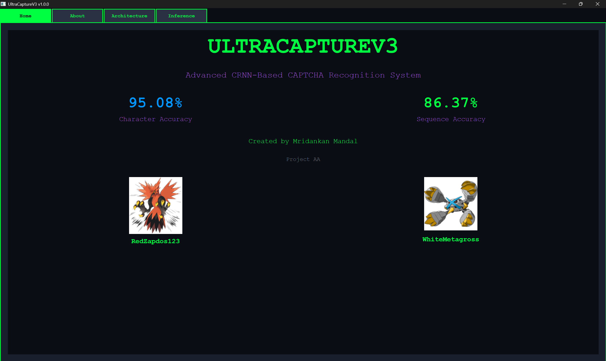
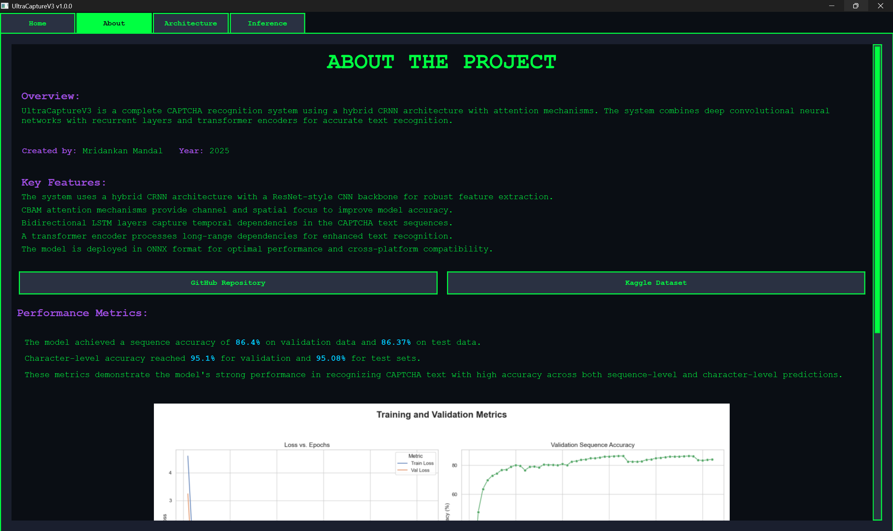
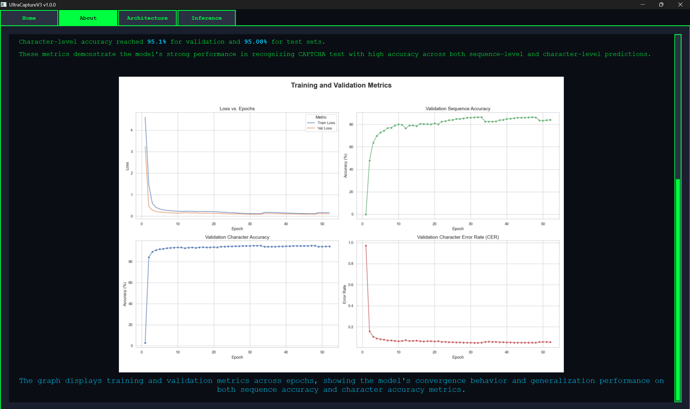
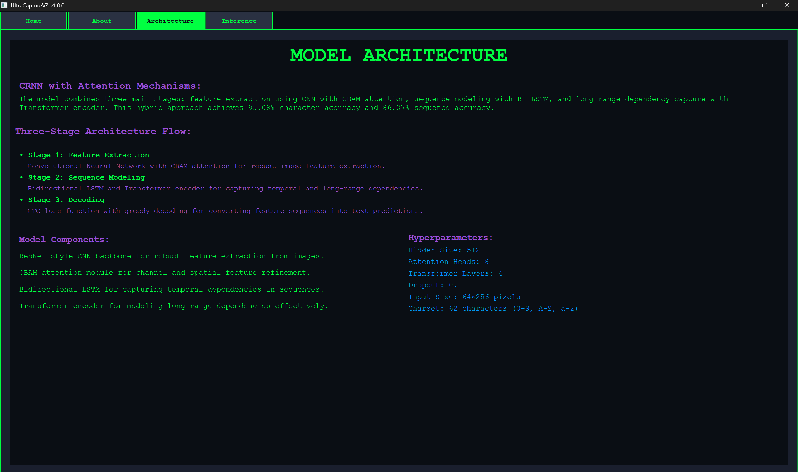
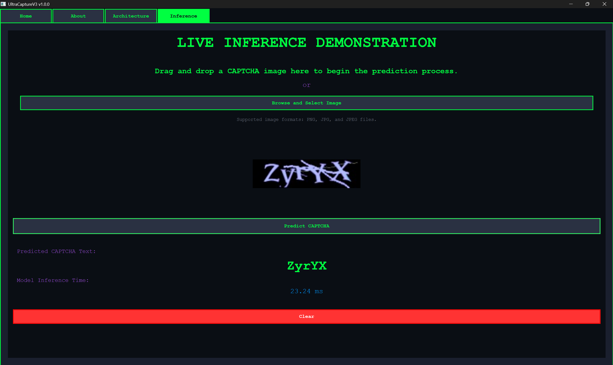

# Usage Guide:

This guide explains how to use the UltraCaptureV3 desktop application. The application is a standalone PySide6-based CAPTCHA recognition system with a Fallout-themed interface.

## Desktop Application Usage:

### Starting the Desktop Application:

Before using the desktop application, ensure setup is complete. See the [Installation and Setup Guide](InstallationAndSetup.md) for detailed instructions.

### Using the Automated Start Script (Recommended):

The easiest way to start the application is using the provided PowerShell script:

```powershell
.\start.ps1
```

**What the script does:**
- Activates the Python virtual environment.
- Launches the PySide6 desktop application with the Fallout-themed interface.
- Displays startup messages and status information.
- Keeps the application running until you close it.

**Expected output:**
```
UltraCaptureV3 Desktop Application

Activating virtual environment...
[OK] Virtual environment activated

Launching application...
[OK] Application starting

UltraCaptureV3 is now running!
```

### Manual Start (Alternative):

If you prefer to start the application manually:

```bash
venv\Scripts\activate  # Windows
python main.py
```

## Accessing the Application:

Once the application is running, the desktop window will open automatically with the Fallout-themed interface.

## Navigating the Interface:

The UltraCaptureV3 desktop application features a Fallout-themed aesthetic with four main tabs:

### 1. Home Tab:

The home page displays:
- **Project Title:** UltraCaptureV3.
- **Tagline:** Advanced CRNN-Based CAPTCHA Recognition System.
- **Accuracy Metrics:**
  - 95.08% Character Accuracy.
  - 86.37% Sequence Accuracy.
- **Creator Information:** Created by Mridankan Mandal as part of Project AA.
- **Project Overview:** Advanced CRNN-based CAPTCHA recognition system.



The home tab displays the main project information with accuracy metrics and creator details in a Fallout-themed interface with the characteristic green and purple color scheme.

**Tab Navigation:**
- Use the tab bar at the top to navigate between tabs.
- Click on "Home", "About", "Architecture", or "Inference" to switch tabs.

### 2. About Tab:

This tab provides comprehensive information about the project:

**Project Overview:**
- Description of the end-to-end CAPTCHA recognition pipeline.
- Explanation of the hybrid CRNN architecture.



The first section of the About tab presents the project overview with detailed descriptions of the CRNN architecture and key features in an organized card-based layout.

**Key Features:**
- The system uses a hybrid CRNN architecture with a ResNet-style CNN backbone for robust feature extraction.
- CBAM attention mechanisms provide channel and spatial focus to improve model accuracy.
- Bidirectional LSTM layers capture temporal dependencies in the CAPTCHA text sequences.
- A transformer encoder processes long-range dependencies for enhanced text recognition.
- The model is deployed in ONNX format for optimal performance and cross-platform compatibility.

**Performance Metrics:**
- Displays validation and test set accuracies.
- Shows model performance details and inference speed information.
- Character Accuracy: 95.08%.
- Sequence Accuracy: 86.37%.



The second section displays comprehensive performance metrics including validation and test set accuracies, with visual graphs showing the model's training and validation performance over time.

**External Links:**
- **GitHub Repository:** Click to view the source code.
- **Kaggle Dataset:** Click to access the training dataset.

### 3. Architecture Tab:

This tab explains the technical details of the model:

**Model Components:**
1. **Convolutional Backbone:** ResNet-style CNN with residual connections for robust feature extraction from images.
2. **CBAM Attention:** Channel and spatial attention mechanisms for feature refinement.
3. **Bi-LSTM:** Bidirectional LSTM for capturing temporal dependencies in sequences.
4. **Transformer Encoder:** Self-attention mechanism for modeling long-range dependencies effectively.

**Hyperparameters:**
- Hidden Size: 512.
- Attention Heads: 8.
- Transformer Layers: 4.
- Dropout: 0.1.
- Input Size: 64×256 pixels.
- Charset: 62 characters (0-9, A-Z, a-z).



The architecture tab displays a comprehensive visual diagram of the CRNN model showing all components including the convolutional backbone, CBAM attention mechanism, bidirectional LSTM, and transformer encoder with their interconnections.

**Architecture Flow:**
- Visual representation of the three-stage process:
  1. Feature Extraction (CNN + CBAM).
  2. Sequence Modeling (Bi-LSTM + Transformer).
  3. Decoding (CTC Loss Function and Greedy Decoding).

### 4. Inference Tab (Live Inference Demonstration):

This is the interactive tab where you can test the model with your own CAPTCHA images.

The Inference tab provides an interactive drag-and-drop interface for uploading CAPTCHA images, displaying predictions, and showing inference timing information in real-time.



The inference tab features a drag-and-drop interface for image upload, real-time prediction display with inference timing, and a clean layout for testing CAPTCHA recognition with custom images.

## Using the Live Inference Demonstration:

### Step 1: Upload an Image:

There are two ways to upload a CAPTCHA image:

**Method 1: Drag and Drop**
1. Locate a CAPTCHA image file on your computer (PNG, JPG, or JPEG format).
2. Drag the file from your file explorer.
3. Drop it into the dashed border area in the Inference tab.

**Method 2: Click to Browse**
1. Click the "Browse and Select Image" button in the Inference tab.
2. A file picker dialog will open.
3. Navigate to your CAPTCHA image.
4. Select the file and click "Open".

**Supported Formats:**
- PNG (.png).
- JPEG (.jpg, .jpeg).

**Image Requirements:**
- The model works best with CAPTCHA images similar to the Huge CAPTCHA Dataset used for training.
- Images will be automatically resized to 64×256 pixels.
- Color images are supported (will be processed as RGB).

### Step 2: Preview the Image:

After uploading, you'll see:
- A preview of your uploaded image.
- An "X" button in the top-right corner to clear the image and start over.

### Step 3: Get Prediction:

1. Click the **"Predict CAPTCHA"** button.
2. The button will change to "Processing..." while the model analyzes the image.
3. Wait for the prediction (usually takes 30-100 milliseconds on CPU with ONNX Runtime).

### Step 4: View Results:

Once processing is complete, you'll see:

**Prediction Display:**
- A large, bold text showing the predicted CAPTCHA text.
- Green background indicating successful prediction.

**Inference Time:**
- The time taken to process the image (in milliseconds).
- Displayed below the prediction.

**Example:**
```
Predicted CAPTCHA Text: aB3xY9
Model Inference Time: 145.23 ms
```

### Step 5: Try Another Image:

After viewing the results:
1. Click the **"Clear"** button to clear the current results and prediction.
2. Upload a new image to test.

Alternatively, click the "X" button on the image preview to start fresh.

## Tips for Best Results:

### Image Quality:
- Use clear, high-contrast CAPTCHA images.
- Avoid heavily distorted or low-resolution images.
- The model performs best on images similar to the Huge CAPTCHA Dataset.

### Supported Characters:
The model recognizes 62 characters:
- **Digits:** 0-9.
- **Uppercase Letters:** A-Z.
- **Lowercase Letters:** a-z.

### Common Issues and Solutions:

**Issue:** Application fails to start.
- **Solution:** Ensure the ONNX model exists at `resources/models/best_model.onnx` and all dependencies are installed.

**Issue:** Prediction is incorrect.
- **Solution:** The model has 86.37% sequence accuracy, so some errors are expected. Try with a clearer image or one more similar to the Huge CAPTCHA Dataset.

**Issue:** Image upload doesn't work.
- **Solution:** Ensure the file is in PNG, JPG, or JPEG format and the file size is reasonable (under 10MB).

**Issue:** Slow inference time.
- **Solution:** First prediction may be slower due to model initialization. Subsequent predictions should be faster (100-200ms).

## Understanding the Results:

### Character Accuracy vs. Sequence Accuracy:

**Character Accuracy (95.08%):**
- Percentage of individual characters correctly predicted.
- Example: If the CAPTCHA is "aB3xY9" and the model predicts "aB3xY8", it gets 5 out of 6 characters correct (83.3% for this image).

**Sequence Accuracy (86.37%):**
- Percentage of entire CAPTCHA sequences correctly predicted.
- The entire prediction must match exactly to count as correct.
- Example: "aB3xY9" vs "aB3xY8" would be 0% sequence accuracy (incorrect), and 83.3% character accuracy.

### Inference Time:

The inference time includes:
1. Image preprocessing (resize, normalize).
2. ONNX model forward pass.
3. CTC decoding.

**Typical Times:**
- First prediction: 200-300ms (model initialization).
- Subsequent predictions: 100-200ms.

**Factors Affecting Speed:**
- CPU performance.
- Image size and complexity.
- System resource availability.

## Advanced Usage:

### Testing Multiple Images:

To test multiple images efficiently:
1. Prepare a folder with multiple CAPTCHA images.
2. Upload and test each image one by one.
3. Note the predictions and compare with ground truth (if available).

### Analyzing Model Performance:

To evaluate the model on your own dataset:
1. Collect a set of CAPTCHA images with known labels.
2. Test each image using the Inference tab.
3. Calculate accuracy:
   - **Character Accuracy:** (Correct characters) / (Total characters).
   - **Sequence Accuracy:** (Correct sequences) / (Total sequences).

## Keyboard Shortcuts:

Currently, the application does not support keyboard shortcuts. All interactions are mouse-based.

## Troubleshooting:

### Common Errors:

**Error:** "No image file provided".
- **Cause:** No file was selected or uploaded.
- **Solution:** Upload a valid image file.

**Error:** "Invalid file type".
- **Cause:** File is not PNG, JPG, or JPEG.
- **Solution:** Convert the image to a supported format.

**Error:** Application crashes when loading an image.
- **Cause:** Image may be corrupted or in an unsupported format.
- **Solution:** Try with a different image or convert to PNG/JPG format.

**Error:** "Internal error during prediction".
- **Cause:** Model encountered an error during processing.
- **Solution:** Check the console output for error messages and ensure the ONNX model exists.

### Performance Issues:

**Slow Predictions:**
- First prediction is always slower (model initialization).
- Check CPU usage and close unnecessary applications.
- Ensure the system has at least 4GB of RAM available.

**Application is unresponsive:**
- Close other applications to free up system resources.
- Restart the application.

## Getting Help:

If you encounter issues not covered in this guide:

1. Check the [Installation and Setup Guide](InstallationAndSetup.md) for setup issues.
2. Consult the [Codebase Index](CodeBaseIndex.md) for technical details.
3. Visit the GitHub repository: https://github.com/WhiteMetagross/CRNN_Captcha_Recognition.

---

## Next Steps.

After familiarizing yourself with the application:

1. Explore the model architecture in the Architecture tab.
2. Check the [README.md](README.md) for project overview and resources.
3. Experiment with different CAPTCHA images to understand the model's capabilities and limitations.
4. For desktop app customization, see the [Codebase Index](CodeBaseIndex.md).

